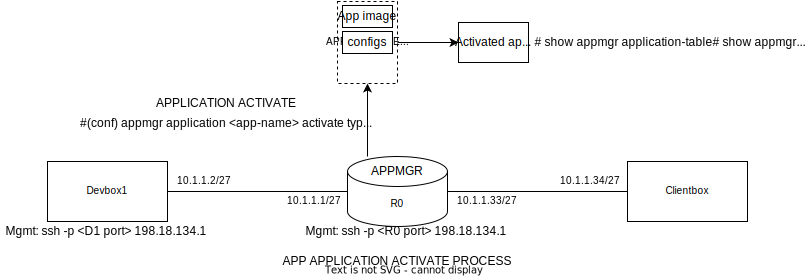

# Deploy apps on the router like a pro with app manager on IOS XR

## Introduction

Welcome to DEVWKS-2519! This is your guide to developing and deploying your own docker applications for Cisco routers running IOS-XR software.

In this workshop you will learn about IOS-XR's application hosting features. We will package an open-source DNS server's docker image (Ubuntu-based bind9) into an IOS-XR supported ```.rpm``` package using appmgr build scripts (https://github.com/ios-xr/xr-appmgr-build).

After creating our ```.rpm``` packages, we will login to the router to install and run our application using IOS-XR appmgr CLI commands. While on the router shell, we will learn about other appmgr CLI commands to monitor running applications and installed packages.

Finally, we will test our application by trying simple DNS requests from a client connected to the router. We will use these DNS requests to discsuss how packets make their way to and from Third Party Applications on IOS-XR. 

Bonus content includes instructions to make your application VRF aware and guidelines for running telemetry applications on the router!


## General Guidelines

- Please feel free to ask any workshop-related questions during the session. For general IOS-XR application hosting related queries, meet me after the session.

- You will use a Cisco anyconnect VPN to connect you to the workshop sandbox environment. You can find instructions to connect to this VPN in a later section of this guide. You will have a WebEx message containing VPN credentials that will be accessible through the workshop laptop.

- Environment: You are going to be using Virtual XR routers (running virtualized Cisco 8000 instances) and  Devbox Linux environments (for packaging applications). You will use ssh to connect to these devices whenver needed. Again, ssh connectivity details accessbile through WebEx on the workshop laptop.

- I will use the "DNZ Workshop 05" WebEx space to broadcast any instructions/commands/messages during this session. Your workshop laptop should be a part of this space.

## Workshop  Topology

This workshop will use a simple topology consisting of the following devices:

- Devbox: This is a Linux environment that we will use to build our appmgr ```rpm ``` package. After installing our DNS Server application on the router, we will use the Devbox as a DNS client and try to resolve domain names to IP addresses using the ```nslookup``` utility which is pre-installed on the Devbox.

- R1: This is a virtual router runnining IOS-XR. The virtual router is emulating the Cisco 8000 series of routers. We will use this router to issue ```appmgr``` commands to install and run our DNS server application package. 

- Clientbox: This is also a  Linux environment. You will not need to access this device. The entry for ```service1.clmel.demo ``` in our DNS server will correspond to this device's IP. We will use this to test connection to this device using ```ping```.


## VPN Connection

To access your assigned workshop environment, you must first connect to the sandbox VPN.

- Begin by opening the Cisco Anyconnect Secure Mobility Client on your workshop laptop. 
- Enter ```dcloud-sjc-anyconnect.cisco.com``` in the VPN field as shown below.
- When prompted for a username and password, enter the credentials provided to you on WebEx.
- A successful VPN connection should be accompanied by a success message on the Anyconnect client.

 
<br></br>
<em>Connecting to the VPN</em>

## Building your application

IOS-XR's appmgr build scripts allow you to package docker images in ```.rpm``` files. The following steps will help you create an appmgr rpm for the ubuntu/bind9 docker image.


### Connecting to your Devbox

- Open a terminal tab on your workshop laptop.
- SSH to the Devbox using the Devbox IP address and port number provided to you on WebEx.
- E.g. ```ssh -p <Devbox port> root@198.18.134.1```

### Using the appmgr build scripts

- The appmgr build scripts are available at https://github.com/ios-xr/xr-appmgr-build. 
- Clone and enter this repository.
 ``` 
 git clone https://github.com/ios-xr/xr-appmgr-build.git 
 cd xr-appmgr-build/ 
 ```
- In this repository, ```appmgr_build``` is the main script that builds ```.rpm``` packages from docker images. Application specific information that can be provided to the ```appmgr_build``` script: 
    - A compressed tarball containing our docker image.
    - A ```.yaml``` file that will specify the build options for our application.
    - [Optional] Config directory containing any configuration files for our application. 
    - [Optional] Data directory containing any other files (e.g., TLS Certs) for our application.
    - Both the Config and Data directories (if created), are packaged in the application ```rpm```. Once this package is installed, these are directories are also unpacked on the router and can be easily accessed by the application using docker volumes and docker bind mounts.
- To simplify our workflow, let us create a directory specific to our application.
```
mkdir bind9/
cd bind9/ 
```
- Now let us add our a compressed docker image in this directory. Since we are using ```ubuntu/bind9``` as our DNS server, we can directly pull this image from Dockerhub. Once the image has been pulled, we can save a compressed version of this image using the ```docker save``` command.
```
docker pull ubuntu/bind9
docker save ubuntu/bind9 > bind.tar.gz 
```

- After we have our compressed docker image, let us create a build.yaml file to add our build options. You can either use the ```vi``` text editor on the Devbox terminal shell. Or use Remote SSH connect with VSCode on your workshop laptop. (https://code.visualstudio.com/docs/remote/ssh)

- For our application, the ```build.yaml``` is provided below:
```yaml
packages:
- name: "bind"
  release: "ThinXR_7.3.15"
  version: "1.0.1"
  sources:
    - name: bind
      file: bind9/bind.tar.gz
  config-dir:
    - name: bind-configs
      dir: bind9/config
```

Using `vi` you can create the `build.yaml` file in the `~/xr-appmgr-build/bind9` directory:

```
vi build.yaml
```

If you are not familiar with using `vi`, you can use issue the following command instead using `echo` to create the `build.yaml` file.

```
echo "packages:
- name: "bind"
  release: "ThinXR_7.3.15"
  version: "1.0.1"
  sources:
    - name: bind
      file: bind9/bind.tar.gz
  config-dir:
    - name: bind-configs
      dir: bind9/config" > ~/xr-appmgr-build/bind9/build.yaml 
```

- The different options set in our ```build.yaml``` are:
    - The name of our package is specified under the name in packages. A single ```build.yaml``` can specify multiple packages to be installed. The ```version``` option can be specified to tag a version to the built ```rpm```. 

    - Release should correspond to an entry in the release_configs directory. ThinXR_7.3.15 corresponds to most current IOS-XR router platforms (including the routers being used in this workshop). To build applications for legacy IOS-XR routers, eXR_7.3.1 must be specified.

    - We must specify the name and path to the docker tarball under sources. The path specified is relative to the root directory of the ```xr-appmgr-build``` repository.

    - [Optional] We specify the name and path to the config directory and data directory under config-dir and data-dir respectively. We are not using data or config directories in this example. Again the path is relative to the root directory of the ```xr-appmgr-build``` repository.

-  Once we have created our ```build.yaml```, we will add configuration files specific to our application. ```ubuntu/bind9``` relies on config files to specify DNS options. 

    - The Devbox has config files for this demo in the ```/root/bind-configs/config``` directory. Copy these files to the ```xr-appmgr-build/bind9 ``` directory. Assuming you cloned the xr-appmgr-build repository in the Devbox's home directory.

    ```
    cp -r /root/bind-configs/config ~/xr-appmgr-build/bind9 
    ```
    - You can inspect the contents of these configs. For the purposes of this demo, the DNS server contains a mapping of ```service1.clmel.demo ``` to ``` 10.1.1.34```. Once we have the DNS server running on the router, we will verify that a client (such as the Devbox) can query the router with a ```DNS WHOIS?``` and get the correct response.
    <br></br>

    **bind-configs/db.ios-xr.tme**
    ```
    $TTL    1d ; default expiration time (in seconds) of all RRs without their own TTL value
    @       IN      SOA     ns1.clmel.demo. root.clmel.demo. (
                    3      ; Serial
                    1d     ; Refresh
                    1h     ; Retry
                    1w     ; Expire
                    1h )   ; Negative Cache TTL

    ; name servers - NS records
        IN      NS      ns1.clmel.demo.

    ; name servers - A records
    ns1.clmel.demo.             IN      A      10.1.1.1

    service1.clmel.demo.        IN      A      10.1.1.34

    ```

    **bind-configs/named.conf.local**
    ```
    zone "clmel.demo" {
    type master;
    file "/etc/bind/zones/db.ios-xr.tme";
    };
    ```
    **bind-configs/named.conf.options**
    ```
    options {
    directory "/var/cache/bind";

    recursion yes;
    listen-on { any; };

    forwarders {
            8.8.8.8;
        };
    };
    ```

- After completing the steps above, the ```bind9``` directory should look like:
```
├── bind.tar.gz
├── build.yaml
└── config
    ├── db.ios-xr.tme
    ├── named.conf.local
    └── named.conf.options
```
- Now let us build our ```rpm``` package. From the ```xr-appmgr-build directory``` issue the build command. 
```
cd ~/xr-appmgr-build/
./appmgr_build -b bind9/build.yaml
```
- The built package will be present in the ```xr-appmgr-build/RPMS/x86_64/``` directory. Copy this ```rpm``` to the router's ```/misc/disk1/``` directory.
- You can use the router IP directly connected to the Devbox, ```10.1.1.1 ```. The router credentials are provided to you on WebEx.
- Copy the build ```rpm``` using the ```scp``` command. Example:
```
scp ~/xr-appmgr-build/RPMS/x86_64/bind-1.0.1-ThinXR_7.3.15.x86_64.rpm cisco@10.1.1.1:/misc/disk1/
```

## Installing and Running your application

### Connecting to your Router (R1)

- Open a another terminal tab on your workshop laptop.
- SSH to the Router (R1) using the Devbox IP address and port number provided to you on WebEx.
- E.g. ```ssh -p <router port> cisco@198.18.134.1```

### Installing the application package


- Now that we have learned how to package docker applications as appmgr rpms, let us try installing and running rpm packages using appmgr.

- After copying the rpm onto the router, we can install it using appmgr CLI commands.
```
appmgr package install rpm /misc/disk1/bind-1.0.1-ThinXR_7.3.15.x86_64.rpm
```
We can verify if the packaged was installed using:
```
show appmgr packages installed
```
Output
```
RP/0/RP0/CPU0:R1#show appmgr packages installed
Tue Jun  6 17:23:26.605 UTC
Package
------------------------------------------------------------
bind-1.0.1-ThinXR_7.3.15.x86_64
RP/0/RP0/CPU0:R1#
```
Once the package has been installed, the application can be activated using the `appmgr application activate` command. This command follows the following syntax:
```
appmgr application my-app activate type docker source hello-world docker-run-opts “<YOUR DOCKER RUN OPTS>”
```
For our application:
```
configure terminal

appmgr application bind activate type docker source bind docker-run-opts "-itd --hostname=ns1 --network=host -v {app_install_root}/config/bind-configs/named.conf.options:/etc/bind/named.conf.options -v {app_install_root}/config/bind-configs/named.conf.local:/etc/bind/named.conf.local -v {app_install_root}/config/bind-configs/db.ios-xr.tme:/etc/bind/zones/db.ios-xr.tme"

commit
end
```


We can verify running application status using the following commands:

#### Show running applications and their status.

```
show appmgr application-table 
```

```
RP/0/RP0/CPU0:R1#show appmgr application-table
Tue Jun  6 17:48:07.659 UTC
Name Type   Config State Status
---- ------ ------------ ------------------------------------------------------
bind Docker  Activated   Up About a minute
 ```

#### Show detailed docker info for a specific application.

 ```
 show appmgr application name bind info detail 
 ```

 ```
RP/0/RP0/CPU0:R1#show appmgr application name bind info detail
Tue Jun  6 17:52:40.745 UTC
Application: bind
  Type: Docker
  Source: bind
  Config State: Activated
  Docker Information:
    Container ID: ef65e0ed742af28d79eca26e1707fab65a6a8e1dc8825304af1d9d3a778bc1bc
    Container name: bind
    Labels: org.opencontainers.image.ref.name=ubuntu,org.opencontainers.image.version=23.04
    Image: ubuntu/bind9:latest
    Command: "docker-entrypoint.sh"
    Created at: 2023-06-06 17:46:47 +0000 UTC
    Running for: 5 minutes ago
    Status: Up 5 minutes
    Size: 104B (virtual 143MB)
    Ports:
    Mounts: debb7c58de6775d3171484e51876e6597ff13af67d4a0280fc3e23e9405702e4,69ab3a12a365b56c8b5ada19c5c6a820e85932ca0f69aeb61b76876b12e7914c,/var/lib/docker/appmgr/config/bind-configs/named.conf.local,/var/lib/docker/appmgr/config/bind-configs/named.conf.options,/var/lib/docker/appmgr/config/bind-configs/db.ios-xr.tme
    Networks: host
    LocalVolumes: 2
 ```

#### Show application logs

```
show appmgr application name bind logs 
```

```
Tue Jun  6 17:56:08.663 UTC
Starting named...
exec /usr/sbin/named -u "bind" "-g" ""
06-Jun-2023 17:46:48.410 starting BIND 9.18.12-1ubuntu1-Ubuntu (Extended Support Version) <id:>
06-Jun-2023 17:46:48.410 running on Linux x86_64 4.8.28-WR9.0.0.26_cgl #1 SMP Sat Jan 14 00:43:09 UTC 2023
06-Jun-2023 17:46:48.410 built with  '--build=x86_64-linux-gnu' '--prefix=/usr' '--includedir=${prefix}/include' '--mandir=${prefix}/share/man' '--infodir=${prefix}/share/info' '--sysconfdir=/etc' '--localstatedir=/var' '--disable-option-checking' '--disable-silent-rules' '--libdir=${prefix}/lib/x86_64-linux-gnu' '--runstatedir=/run' '--disable-maintainer-mode' '--disable-dependency-tracking' '--libdir=/usr/lib/x86_64-linux-gnu' '--sysconfdir=/etc/bind' '--with-python=python3' '--localstatedir=/' '--enable-threads' '--enable-largefile' '--with-libtool' '--enable-shared' '--disable-static' '--with-gost=no' '--with-openssl=/usr' '--with-gssapi=yes' '--with-libidn2' '--with-json-c' '--with-lmdb=/usr' '--with-gnu-ld' '--with-maxminddb' '--with-atf=no' '--enable-ipv6' '--enable-rrl' '--enable-filter-aaaa' '--disable-native-pkcs11' 'build_alias=x86_64-linux-gnu' 'CFLAGS=-g -O2 -ffile-prefix-map=/build/bind9-Za0Td3/bind9-9.18.12=. -flto=auto -ffat-lto-objects -fstack-protector-strong -Wformat -Werror=format-security -fdebug-prefix-map=/build/bind9-Za0Td3/bind9-9.18.12=/usr/src/bind9-1:9.18.12-1ubuntu1 -fno-strict-aliasing -fno-delete-null-pointer-checks -DNO_VERSION_DATE -DDIG_SIGCHASE' 'LDFLAGS=-Wl,-Bsymbolic-functions -flto=auto -ffat-lto-objects -Wl,-z,relro -Wl,-z,now' 'CPPFLAGS=-Wdate-time -D_FORTIFY_SOURCE=2'
```

#### Show application stats
```
show appmgr application name bind stats 
```

```
Tue Jun  6 17:54:36.888 UTC
Application Stats: bind
   CPU Percentage: 0.00%
   Memory Usage: 6.906MiB / 19.42GiB
   Memory Percentage: 0.03%
   Network IO: 0B / 0B
   Block IO: 0B / 81.9kB
   PIDs: 10
```

We can perform actions on running applications using the following commands:
<br></br>
**Note that these are reference commands. Please do not execute them on the router, they may stop/kill our running application**

#### Copy files from router file system to application container

E.g., ```appmgr application copy harddisk:foo/ bind:/bar```

#### Execute command inside the application container

E.g., To drop into the router shell ```appmgr application exec name bind docker-exec-cmd /bin/bash/```

```
RP/0/RP0/CPU0:R1#appmgr application exec name bind docker-exec-cmd /bin/bash
Tue Jun  6 18:01:04.855 UTC
root@ns1:/#
```

#### Kill a running application

E.g., ```appmgr application kill name bind```

#### Stop a running application

E.g., ```appmgr application stop name bind ```

#### Start a running application

E.g., ```appmgr application start name bind ```

### Testing our application

To test our application let us first reconnect to our Devbox.

- Open a new terminal tab on your workshop laptop or go back to the original Devbox SSH terminal.
- If your SSH session was terminated, SSH to the Devbox using the Devbox IP address and port number provided to you on WebEx.
- E.g. ```ssh -p <Devbox port> root@198.18.134.1```

We will use the Devbox as our DNS client so let us configure the Devbox to use our DNS Server as its primary NS.

Open the `/etc/resolv.conf` file on the Devbox with a text editor like `vi`.

`vi /etc/resolv.conf`

The contents of `/etc/resolv.conf` should look like:

```
; generated by /usr/sbin/dhclient-script
nameserver 192.168.122.1
search localdomain
```

Edit this file to add our DNS server, `nameserver 10.1.1.1` in this list.

Alternatively, if you are not familiar with `vi`, you can use the following command with `echo`.

```
echo "; generated by /usr/sbin/dhclient-script
nameserver 10.1.1.1
nameserver 192.168.122.1
search localdomain" > /etc/resolv.conf
```

Your final edited `/etc/resolv.conf` should look like:

```
; generated by /usr/sbin/dhclient-script
nameserver 10.1.1.1
nameserver 192.168.122.1
search localdomain
```

Now let us try issuing an `nslookup` query for the entry in our DNS Server - `service1.clmel.demo`. Your DNS server should be able to provide you with a response with the IP address of the Clientbox.

```
nslookup service1.clmel.demo
```

We should get a response with the IP address of `service1.clmel.demo` resolved:

```
[root@localhost ~]# nslookup service1.clmel.demo
Server:		10.1.1.1
Address:	10.1.1.1#53

Name:	service1.clmel.demo
Address: 10.1.1.34
```

Let us try using `ping` to reach the Clientbox. 

```
ping service1.clmel.demo
```

We should be able to ping the Clientbox:

```
[root@localhost ~]# ping service1.clmel.demo
PING service1.clmel.demo (10.1.1.34) 56(84) bytes of data.
64 bytes from 10.1.1.34 (10.1.1.34): icmp_seq=1 ttl=63 time=3.52 ms
64 bytes from 10.1.1.34 (10.1.1.34): icmp_seq=2 ttl=63 time=4.88 ms
64 bytes from 10.1.1.34 (10.1.1.34): icmp_seq=3 ttl=63 time=3.67 ms
```

We have succesfully used our DNS app to reach our Clientbox!

### Bonus Content - Running our application in a VRF

We may have a scenario where our application has to send and receive traffic over interfaces in VRFs other than the global VRF.

To support this, VRFs created in IOS-XR are mapped as Linux Network Namespaces. For e.g., when you create vrf `green` in XR, there is a corresponding `vrf-green` Linux Network Namespace created. These namespaces are present in the `/var/run/netns/` directory on the router's filesystem. Any container that needs to send or receive traffic over VRF interfaces needs to map this directory into the container filesystem.

We can easily extend our DNS example to receive DNS queries from the Devbox over a Linux network namespace.

To begin with, remove IP address configuration from the router interface connected to the Devbox. 

```
configure
interface FourHundredGigE0/0/0/0
 no ipv4 address 10.1.1.1 255.255.255.224
!
commit
end
```
Next create a new VRF.
```
configure
vrf green
commit
end
```
Now, let's add our router interface connected to the Devbox to this VRF
```
configure
interface FourHundredGigE0/0/0/0
 vrf green
 ipv4 address 10.1.1.1 255.255.255.224
!
commit
end
```
Now that our interface is in `vrf green`. Let's start our DNS server in this VRF

Stop the previous container

```
configure
no appmgr application bind
commit
end
```

Start a new container with a docker exec command that starts the bind9 process inside `vrf green`
```
appmgr application bind activate type docker source bind docker-run-opts "-d --hostname=ns1 --network=host -v {app_install_root}/config/bind-configs/named.conf.options:/etc/bind/named.conf.options -v /var/run/netns:/var/run/netns -v {app_install_root}/config/bind-configs/named.conf.local:/etc/bind/named.conf.local -v {app_install_root}/config/bind-configs/db.ios-xr.tme:/etc/bind/zones/db.ios-xr.tme --cap-add=NET_ADMIN --cap-add=SYS_ADMIN" docker-run-cmd "ip netns exec vrf-green /usr/sbin/named -g -c /etc/bind/named.conf -u bind"
```

Alternatively, instead of launching applications in network namespaces or making application network namespace aware, we can use an appmgr feature to support port forwarding between different VRFs.

To use this feature, we can include a `--vrf-forward` option in our `docker-run-opts` section of the `appmgr activate` command. The following option will forward traffic between port 5053 of `vrf-green` and port 53 of `vrf` default.

```
--vrf-forward vrf-blue:5053 vrf-default:53
```