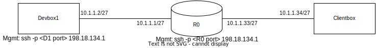
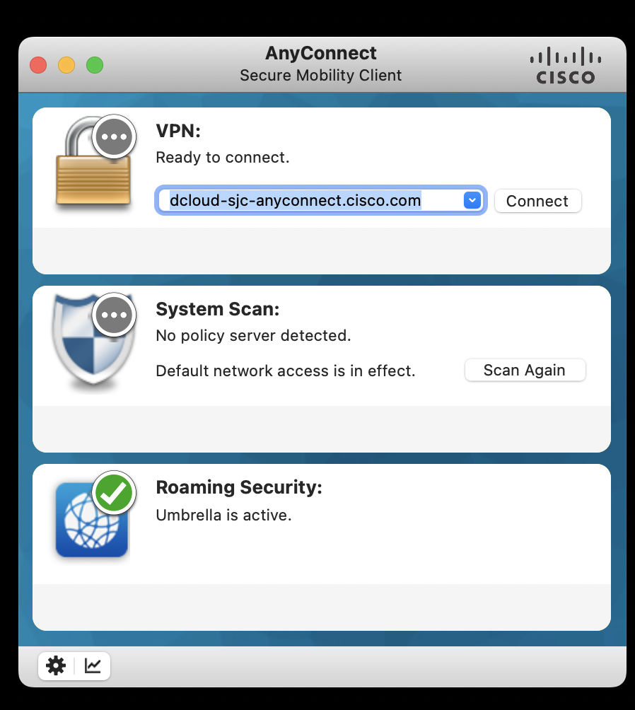
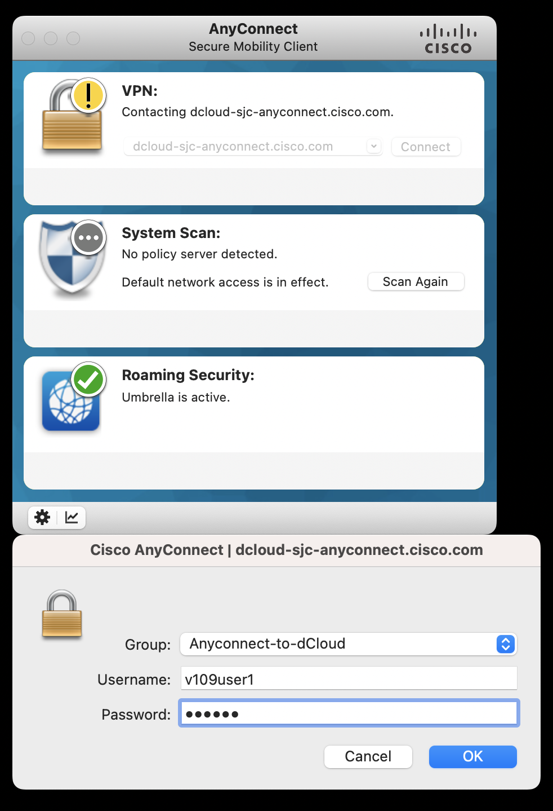
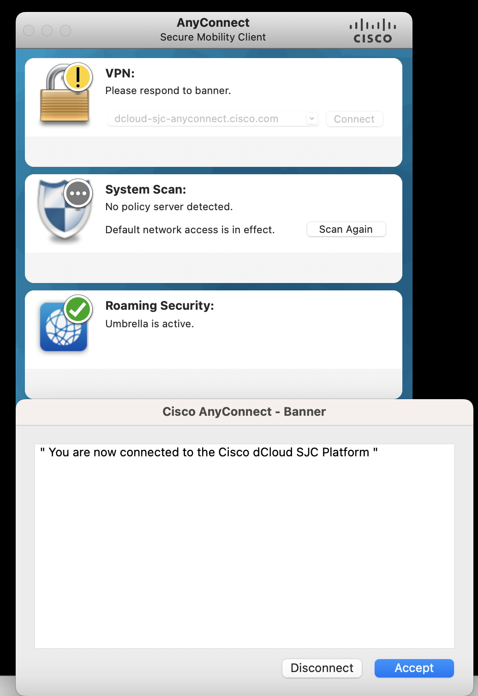
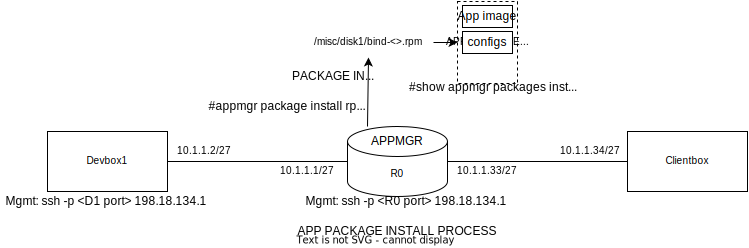

# Deploy apps on the router like a pro with app manager on IOS XR

## Introduction

Welcome to DEVWKS-2125! This is your guide to developing and deploying your own docker applications for Cisco routers running IOS-XR software.

In this workshop you will learn about IOS-XR's application hosting features. We will package an open-source DNS server's docker image (Ubuntu-based bind9) into an IOS-XR supported ```.rpm``` package using appmgr build scripts (https://github.com/ios-xr/xr-appmgr-build).

After creating our ```.rpm``` packages, we will login to the router to install and run our application using IOS-XR appmgr CLI commands. While on the router shell, we will learn about other appmgr CLI commands to monitor running applications and installed packages.

Finally, we will test our application by trying simple DNS requests from a client connected to the router. We will use these DNS requests to discsuss how packets make their way to and from Third Party Applications on IOS-XR. 

Bonus content includes instructions to make your application VRF aware and guidelines for running telemetry applications on the router!


## General Guidelines

- Please feel free to ask any workshop-related questions during the session. For general IOS-XR application hosting related queries, meet me after the session.

- You will use a Cisco anyconnect VPN to connect you to the workshop sandbox environment. You can find instructions to connect to this VPN in a later section of this guide. You will have a WebEx message containing VPN credentials that will be accessible through the workshop laptop.

- Environment: You are going to be using Virtual XR routers (running virtualized Cisco 8000 instances) and Centos7 Devbox VMs (for building images). You will use ssh to connect to these devices whenver needed. Again, ssh connectivity details will be on your desk or accessbile through WebEx on the workshop laptop.

- I will use the "DNZ Workshop 05" WebEx space to broadcast any instructions/commands/messages during this session. Your workshop laptop should be a part of this space.

## Workshop  Topology

This workshop will use a simple topology consisting of the following devices:

- Devbox: This is a Centos7 Linux environment that we will use to build our appmgr ```rpm ``` package. After installing our DNS Server application on the router, we will use the Devbox as a DNS client and try to resolve domain names to IP addresses using the ```nslookup``` utility which is pre-installed on the Devbox.

- R0: This is a virtual router runnining IOS-XR. The virtual router is emulating the Cisco 8000 series of routers. We will use this router to issue ```appmgr``` commands to install and run our DNS server application package. 

- Clientbox: This is also a Centos7 Linux environment. You will not need to access this device. The entry for ```service1.clus.demo ``` in our DNS server will correspond to this device's IP. We will use this to test connection to this device using ```ping``` and ```netcat```.



## VPN Connection

To access your assigned workshop environment, you must first connect to the sandbox VPN.

- Begin by opening the Cisco Anyconnect Secure Mobility Client on your workshop laptop. 
- Enter ```dcloud-sjc-anyconnect.cisco.com``` in the VPN field as shown below.
- When prompted for a username and password, enter the credentials provided to you on WebEx.
- A successful VPN connection should be accompanied by a success message on the Anyconnect client.

 
<br></br>
<em>Connecting to the VPN</em>

## Building your application

IOS-XR's appmgr build scripts allow you to package docker images in ```.rpm``` files. The following steps will help you create an appmgr rpm for the ubuntu/bind9 docker image.


### Connecting to your Devbox

- Open a terminal tab on your workshop laptop.
- SSH to the Devbox using the Devbox IP address and port number provided to you on your desk and on WebEx.
- E.g. ```ssh -p <Devbox port> root@198.18.134.1```

### Using the appmgr build scripts

- The appmgr build scripts are available at https://github.com/ios-xr/xr-appmgr-build. 
- Clone and enter this repository.
 ``` 
 git clone https://github.com/ios-xr/xr-appmgr-build.git 
 cd xr-appmgr-build/
 ```
- In this repository, ```appmgr_build``` is the main script that builds ```.rpm``` packages from docker images. Application specific information that can be provided to the ```appmgr_build``` script: 
    - A compressed tarball containing our docker image.
    - A ```.yaml``` file that will specify the build options for our application.
    - [Optional] Config directory containing any configuration files for our application. 
    - [Optional] Data directory containing any other files (e.g., TLS Certs) for our application.
    - Both the Config and Data directories (if created), are packaged in the application ```rpm```. Once this package is installed, these are directories are also unpacked on the router and can be easily accessed by the application using docker volumes and docker bind mounts.
- To simplify our workflow, let us create a directory specific to our application.
```
mkdir bind9/
cd bind9/
```
- Now let us add our a compressed docker image in this directory. Since we are using ```ubuntu/bind9``` as our DNS server, we can directly pull this image from Dockerhub. Once the image has been pulled, we can save a compressed version of this image using the ```docker save``` command.
```
docker pull ubuntu/bind9
docker save ubuntu/bind9 > bind.tar.gz
```

- After we have our compressed docker image, let us create a build.yaml file to add our build options. You can either use the ```vi``` text editor on the Devbox terminal shell. Or use Remote SSH connect with VSCode on your workshop laptop. (https://code.visualstudio.com/docs/remote/ssh)

- For our application, the ```build.yaml``` is provided below:
```yaml
packages:
- name: "bind"
  release: "ThinXR_7.3.15"
  version: "1.0.1"
  sources:
    - name: bind
      file: bind9/bind.tar.gz
  config-dir:
    - name: bind-configs
      dir: bind9/bind-configs
```

Using `vi`:

```
vi build.yaml
```

 When you enter the command above, you will have a vi terminal for a new file `build.yaml` open. Type `i` to enter in the insert mode. Paste (`Ctrl+V` or `Command+V`) the copied `build.yaml` contents from above. Press ```Esc``` to go back to the command mode. Type `wq` and the press `Enter` to save and quit vi.

- The different options set in our ```build.yaml``` are:
    - The name of our package is specified under the name in packages. A single ```build.yaml``` can specify multiple packages to be installed. The ```version``` option can be specified to tag a version to the built ```rpm```. 

    - Release should correspond to an entry in the release_configs directory. ThinXR_7.3.15 corresponds to most current IOS-XR router platforms (including the routers being used in this workshop). To build applications for legacy IOS-XR routers, eXR_7.3.1 must be specified.

    - We must specify the name and path to the docker tarball under sources. The path specified is relative to the root directory of the ```xr-appmgr-build``` repository.

    - [Optional] We specify the name and path to the config directory and data directory under config-dir and data-dir respectively. We are not using data or config directories in this example. Again the path is relative to the root directory of the ```xr-appmgr-build``` repository.

-  Once we have created our ```build.yaml```, we will add configuration files specific to our application. ```ubuntu/bind9``` relies on config files to specify DNS options. 

    - The Devbox has config files for this demo in the ```/root/bind-configs/config``` directory. Copy these files to the ```xr-appmgr-build/bind9 ``` directory. Assuming you cloned the xr-appmgr-build repository in the Devbox's home directory.

    ```
    cp -r /root/bind-configs/ ~/xr-appmgr-build/bind9 
    ```
    - You can inspect the contents of these configs. For the purposes of this demo, the DNS server contains a mapping of ```service1.clus.demo ``` to ``` 10.1.1.34```. Once we have the DNS server running on the router, we will verify that a client (such as the Devbox) can query the router with a ```DNS WHOIS?``` and get the correct response.
    <br></br>
    **bind-configs/db.ios-xr.tme**
    ```
    $TTL    1d ; default expiration time (in seconds) of all RRs without their own TTL value
    @       IN      SOA     ns1.clus.demo. root.clus.demo. (
                    3      ; Serial
                    1d     ; Refresh
                    1h     ; Retry
                    1w     ; Expire
                    1h )   ; Negative Cache TTL

    ; name servers - NS records
        IN      NS      ns1.clus.demo.

    ; name servers - A records
    ns1.clus.demo.             IN      A      10.1.1.1

    service1.clus.demo.        IN      A      10.1.1.34

    ```

    **bind-configs/named.conf.local**
    ```
    zone "clus.demo" {
    type master;
    file "/etc/bind/zones/db.ios-xr.tme";
    };
    ```
    **bind-configs/named.conf.options**
    ```
    options {
    directory "/var/cache/bind";

    recursion yes;
    listen-on { any; };

    forwarders {
            8.8.8.8;
        };
    };
    ```

- After completing the steps above, the ```bind9``` directory should look like:
```
├── bind.tar.gz
├── build.yaml
└── config
    ├── db.ios-xr.tme
    ├── named.conf.local
    └── named.conf.options
```
- Now let us build our ```rpm``` package. From the ```xr-appmgr-build directory``` issue the build command. 
```
cd ~/xr-appmgr-build/
./appmgr_build -b bind9/build.yaml
```
- The built package will be present in the ```xr-appmgr-build/RPMS/x86_64/``` directory. Copy this ```rpm``` to the router's ```/misc/disk1/``` directory.
- You can use the router IP directly connected to the Devbox, ```10.1.1.1 ```. The router credentials are provided to you on your desk and on WebEx.
- Copy the build ```rpm``` using the ```scp``` command. Example:
```
scp ~/xr-appmgr-build/RPMS/x86_64/bind-1.0.1-ThinXR_7.3.15.x86_64.rpm cisco@10.1.1.1:/misc/disk1/
```

## Installing and Running your application

### Connecting to your Router (R0)

- Open a another terminal tab on your workshop laptop.
- SSH to the Router (R0) using the Devbox IP address and port number provided to you on your desk and on WebEx.
- E.g. ```ssh -p <router port> cisco@198.18.134.1```

### Installing the application package



- Now that we have learned how to package docker applications as appmgr rpms, let us try installing and running rpm packages using appmgr.

- After copying the rpm onto the router, we can install it using appmgr CLI commands.
```
appmgr package install rpm /misc/disk1/bind-1.0.1-ThinXR_7.3.15.x86_64.rpm
```
We can verify if the packaged was installed using:
```
show appmgr packages installed
```
Once the package has been installed, the application can be activated using
```
(conf) appmgr application my-app activate type docker source hello-world docker-run-opts “<YOUR DOCKER RUN OPTS>”
```
For our application:
```
configure terminal

appmgr application bind activate type docker source bind docker-run-opts "-itd --hostname=ns1 --network=host -v {app_install_root}/config/bind-configs/named.conf.options:/etc/bind/named.conf.options -v {app_install_root}/config/bind-configs/named.conf.local:/etc/bind/named.conf.local -v {app_install_root}/config/bind-configs/db.ios-xr.tme:/etc/bind/zones/db.ios-xr.tme"

commit
```